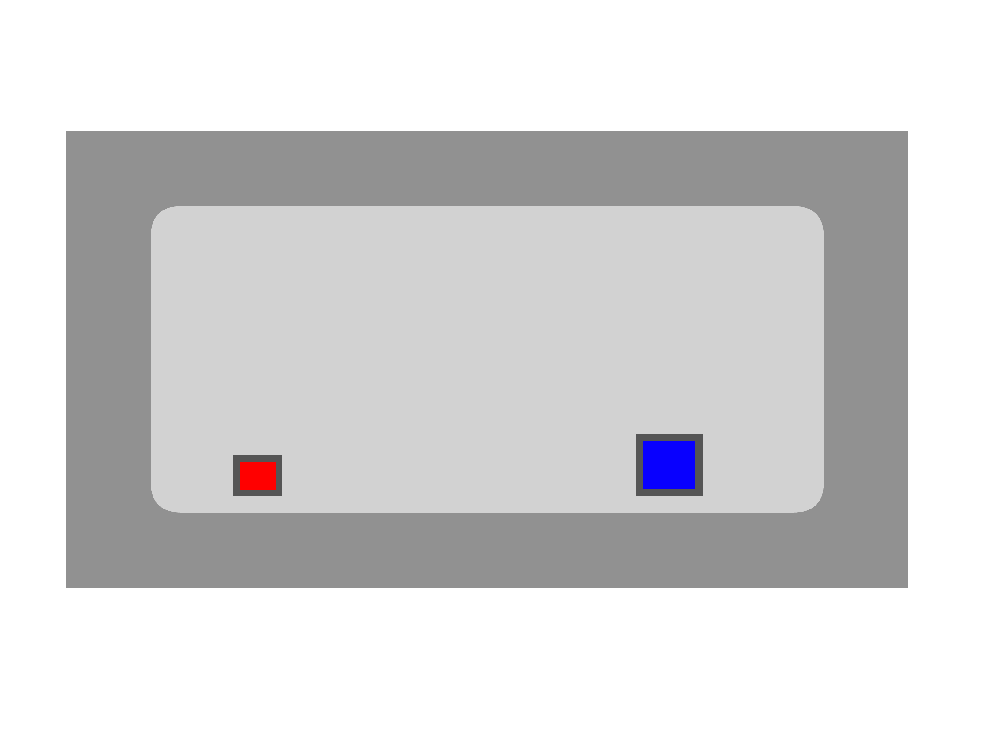

The game is a 1-on-1 2D arena battle that I made using a bunch of random guides on Youtube.
I made the sprites for the game completely by myself.

There are 3 different squares you can play as and they each shoot out different attacks to hit the opponent.

I didn't save anything when making this game as it was on a school computer. Here is a quick recreation of what it looked like.
